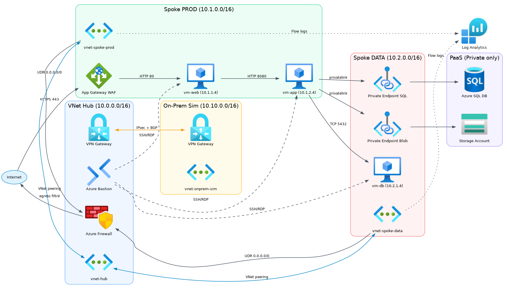
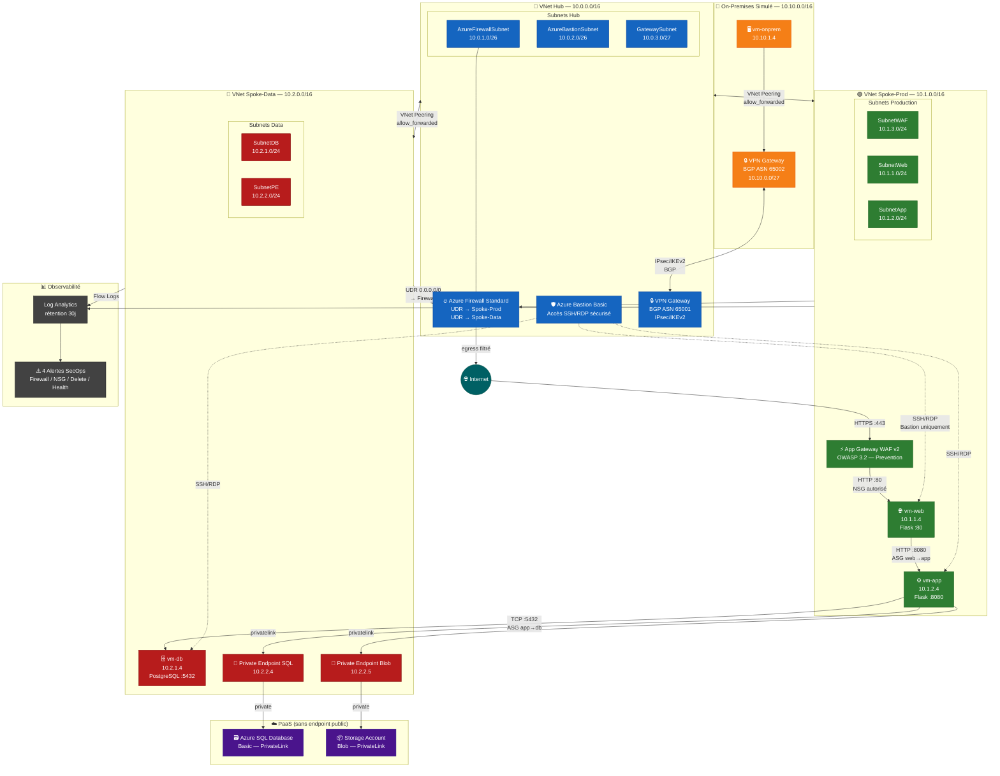
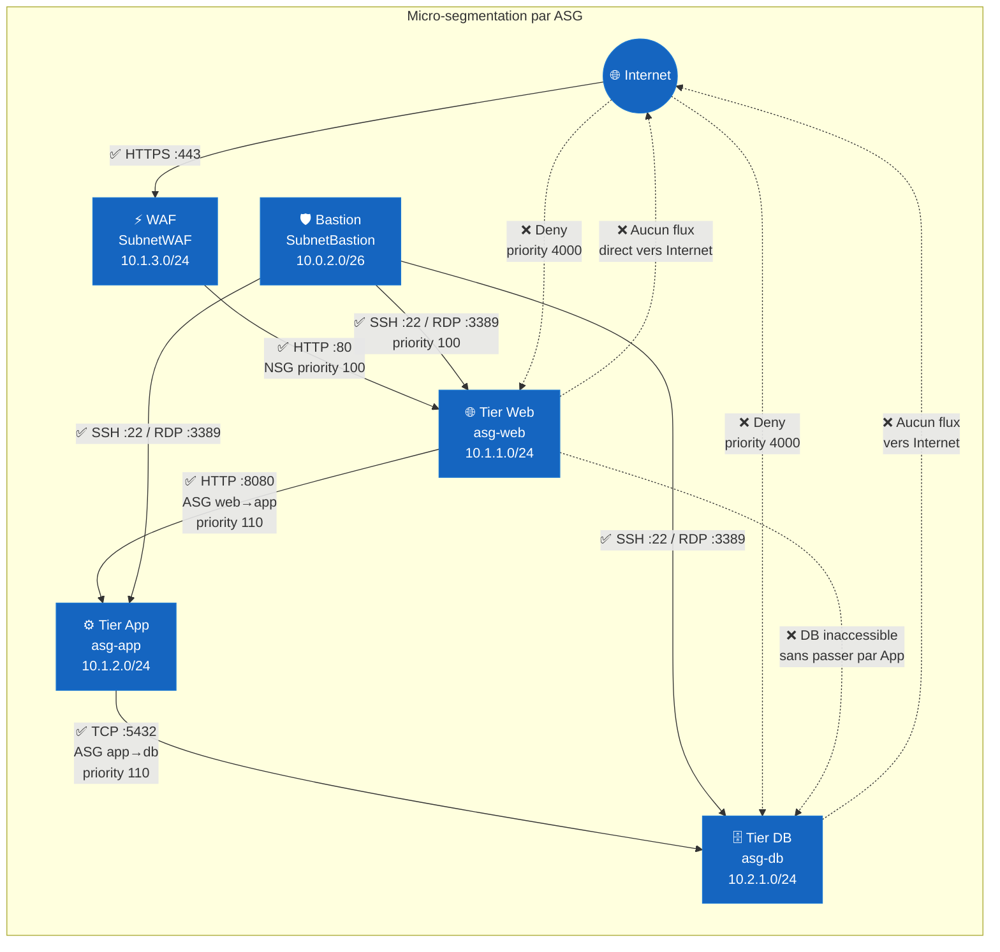

# 🏗️ Architecture Cloud Shield — Schémas Infrastructure

> Source de vérité : fichiers Terraform (`variables.auto.tfvars` + `.tf`)
> Rendu natif GitHub & Docsify via Mermaid.js

---

## 1. Schémas

- PNG: [assets/diagrams/cloudshield-azure-icons.png](assets/diagrams/cloudshield-azure-icons.png)
- SVG: [assets/diagrams/cloudshield-azure-icons.svg](assets/diagrams/cloudshield-azure-icons.svg)
- Source DOT: [assets/diagrams/cloudshield-azure-icons.dot](assets/diagrams/cloudshield-azure-icons.dot)

---

## 2. Vue Globale — Hub & Spoke

---

## 3. Zero Trust — Matrice de Flux East-West

---

## 4. Dépendances Terraform — Ressources Clés

```mermaid
graph LR
    subgraph RG["rg-cloudshield-prod — francecentral"]
        subgraph NETWORK["Réseau"]
            HUB["vnet-hub\n10.0.0.0/16"]
            PROD["vnet-spoke-prod\n10.1.0.0/16"]
            DATA["vnet-spoke-data\n10.2.0.0/16"]
            ONPREM["vnet-onprem-sim\n10.10.0.0/16"]
        end

        subgraph SECURITY["Sécurité"]
            FW["azurerm_firewall\nfw-cloudshield"]
            FW_POL["azurerm_firewall_policy\nfwpol-cloudshield"]
            NGS_WEB["azurerm_nsg\nnsg-web"]
            NSG_APP["azurerm_nsg\nnsg-app"]
            NSG_DB["azurerm_nsg\nnsg-db"]
            ASG_WEB["asg-web"]
            ASG_APP["asg-app"]
            ASG_DB["asg-db"]
        end

        subgraph COMPUTE["Compute"]
            VMWEB["vm-web\nB1s"]
            VMAPP["vm-app\nB1s"]
            VMDB["vm-db\nB1s"]
            VMONPREM["vm-onprem\nB1s"]
        end

        subgraph PAAS_RES["PaaS"]
            SQLSRV["sql-cloudshield-*\nAzure SQL"]
            STLOG["stcloudshield*\nBlob Logs"]
            PE1["pe-sql\nprivatelink.sql"]
            PE2["pe-blob\nprivatelink.blob"]
        end

        subgraph UDR_RES["Routing UDR"]
            RT_PROD["rt-spoke-prod\n0.0.0.0/0 → Firewall"]
            RT_DATA["rt-spoke-data\n0.0.0.0/0 → Firewall"]
        end

        subgraph VPN_RES["VPN (deploy_vpn_gateways=false)"]
            VPN_HUB["vpn-gw-hub\nBGP 65001"]
            VPN_ONP["vpn-gw-onprem\nBGP 65002"]
        end
    end

    %% Dépendances réseau
    FW_POL --> FW
    HUB --> FW
    HUB --> NGS_WEB
    PROD --> NGS_WEB
    PROD --> NSG_APP
    DATA --> NSG_DB

    %% UDR → Firewall
    RT_PROD -->|"nexthop = FW IP"| FW
    RT_DATA -->|"nexthop = FW IP"| FW
    PROD --> RT_PROD
    DATA --> RT_DATA

    %% VMs → NSG/ASG
    VMWEB --> ASG_WEB
    VMAPP --> ASG_APP
    VMDB --> ASG_DB

    %% Private Endpoints → PaaS
    PE1 --> SQLSRV
    PE2 --> STLOG
    DATA --> PE1
    DATA --> PE2

    %% VPN
    HUB --> VPN_HUB
    ONPREM --> VPN_ONP
    VPN_HUB <-->|"IPsec/BGP"| VPN_ONP

    classDef network fill:#1565C0,stroke:#0D47A1,color:#fff
    classDef security fill:#B71C1C,stroke:#7F0000,color:#fff
    classDef compute fill:#2E7D32,stroke:#1B5E20,color:#fff
    classDef paas fill:#4A148C,stroke:#311B92,color:#fff
    classDef routing fill:#E65100,stroke:#BF360C,color:#fff
    classDef vpn fill:#37474F,stroke:#263238,color:#fff

    class HUB,PROD,DATA,ONPREM network
    class FW,FW_POL,NGS_WEB,NSG_APP,NSG_DB,ASG_WEB,ASG_APP,ASG_DB security
    class VMWEB,VMAPP,VMDB,VMONPREM compute
    class SQLSRV,STLOG,PE1,PE2 paas
    class RT_PROD,RT_DATA routing
    class VPN_HUB,VPN_ONP vpn
```

---

## 5. Plan d'Adressage IP (IPAM)

| Composant      | VNet / Subnet       | CIDR           | Rôle                          |
| -------------- | ------------------- | -------------- | ----------------------------- |
| **Hub**        | vnet-hub            | `10.0.0.0/16`  | Sécurité, egress, hybridation |
| ↳              | AzureFirewallSubnet | `10.0.1.0/26`  | Azure Firewall Standard       |
| ↳              | AzureBastionSubnet  | `10.0.2.0/26`  | Azure Bastion Basic           |
| ↳              | GatewaySubnet       | `10.0.3.0/27`  | VPN Gateway                   |
| **Spoke-Prod** | vnet-spoke-prod     | `10.1.0.0/16`  | Application 3-tiers           |
| ↳              | SubnetWAF           | `10.1.3.0/24`  | Application Gateway WAF       |
| ↳              | SubnetWeb           | `10.1.1.0/24`  | vm-web Flask :80              |
| ↳              | SubnetApp           | `10.1.2.0/24`  | vm-app Flask :8080            |
| **Spoke-Data** | vnet-spoke-data     | `10.2.0.0/16`  | Base de données & PaaS        |
| ↳              | SubnetDB            | `10.2.1.0/24`  | vm-db PostgreSQL :5432        |
| ↳              | SubnetPE            | `10.2.2.0/24`  | Private Endpoints             |
| **OnPrem Sim** | vnet-onprem-sim     | `10.10.0.0/16` | Lyon datacenter simulé        |
| ↳              | GatewaySubnet       | `10.10.0.0/27` | VPN Gateway OnPrem            |
| ↳              | SubnetSrv           | `10.10.1.0/24` | vm-onprem                     |
