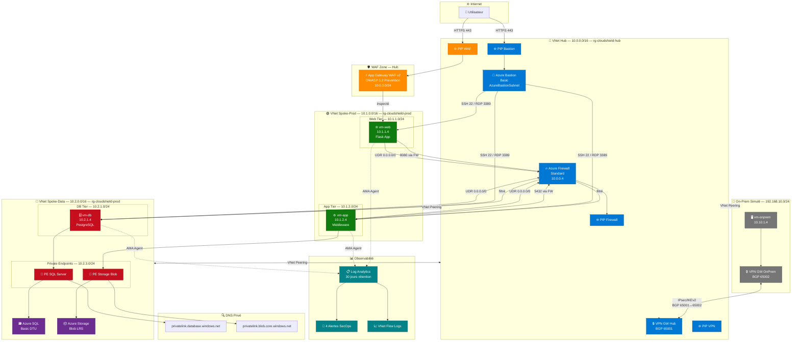
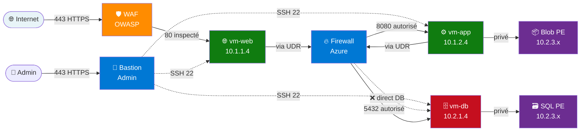
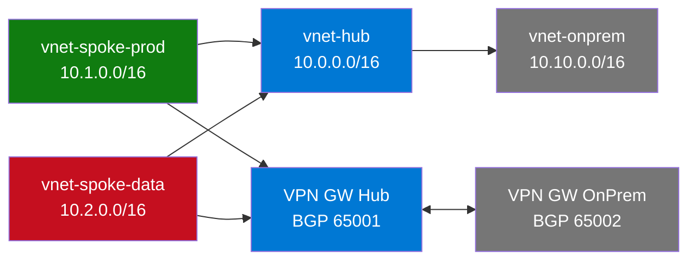

# 🏗️ Architecture Cloud Shield — Schéma Infra

> **Source de vérité** : généré depuis le code Terraform via InfraMap v0.7.0
> Rendu natif GitHub / Docsify via Mermaid.js

---

## Hub & Spoke — Vue Globale

---

## Flux Réseau — Matrice Zero Trust

---

## Dépendances Terraform — InfraMap

> Fichier DOT brut disponible dans [`docs/inframap.dot`](inframap.dot) —
> Rendu en ligne : [GraphvizOnline](https://dreampuf.github.io/GraphvizOnline/) ou [Kroki](https://kroki.io/)

