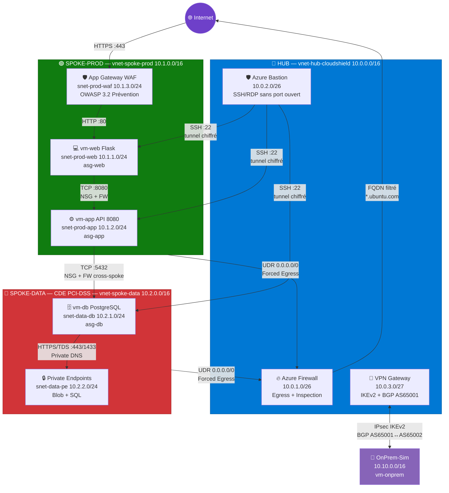

# <i class="fa-solid fa-sitemap"></i> LIVRABLE 2 — Dossier d'Architecture Technique (DAT)

## Cloud Shield — Landing Zone Azure "Secure by Design"

<div style="margin-bottom:1.5em">
  
  
  
  
</div>

| Champ              | Valeur                 |
| ------------------ | ---------------------- |
| **Client**         | FinTech Global         |
| **Cabinet**        | Expert Cloud & Réseaux |
| **Date**           | 31 mars 2026           |
| **Version**        | 1.0                    |
| **Classification** | Confidentiel           |

---

## Table des matières

1. [Résumé Exécutif](#1-résumé-exécutif)
2. [Architecture Globale — Schéma HLD](#2-architecture-globale--schéma-hld)
3. [Plan d'Adressage IP (IPAM)](#3-plan-dadressage-ip-ipam)
4. [Matrices de Flux Réseau](#4-matrices-de-flux-réseau)
5. [Justification des Choix Architecturaux](#5-justification-des-choix-architecturaux)
6. [Chapitre FinOps](#6-chapitre-finops)
7. [Chapitre DevSecOps](#7-chapitre-devsecops)
8. [Prouving ANSSI — 10 Preuves Techniques](#8-prouving-anssi--10-preuves-techniques)

---

## 1. Résumé Exécutif

Suite à l'incident cyber ayant paralysé FinTech Global pendant 4 jours et à l'audit flash de la Banque de France, la Direction a mandaté la migration intégrale du SI vers Microsoft Azure.

L'architecture cible repose sur un modèle **Hub & Spoke** avec :

- **Isolation totale** des environnements (Production, Données, On-Premises)
- **Zero Trust** : tout trafic refusé par défaut, autorisé explicitement
- **Inspection centralisée** de tout le trafic (entrant ET sortant) via Azure Firewall
- **Chiffrement en transit** : IPsec IKEv2 + BGP pour l'hybridation
- **Sanctuarisation PaaS** : Private Endpoints sans endpoint public
- **Observabilité complète** : SIEM centralisé (Log Analytics + AMA + Flow Logs)

---

## 2. Architecture Globale — Schéma HLD

### Diagramme textuel de l'architecture Hub & Spoke

```
                        ┌──────────────────────────────────────┐
                        │          INTERNET                    │
                        └────────┬─────────────┬───────────────┘
                                 │             │
                          ┌──────▼──────┐ ┌───▼────────────┐
                          │  WAF/AppGW  │ │  VPN Gateway   │
                          │  (pip-waf)  │ │  Hub (pip-vpn) │
                          └──────┬──────┘ └───┬────────────┘
                                 │            │
    ┌────────────────────────────┼────────────┼────────────────────────────┐
    │                     HUB VNET (10.0.0.0/16)                           │
    │                            │            │                            │
    │  ┌─────────────────┐  ┌───▼────────────▼───┐  ┌──────────────────┐   │
    │  │ AzureBastion     │  │ AzureFirewall       │  │ GatewaySubnet  │   │
    │  │ Subnet           │  │ Subnet              │  │                │   │
    │  │ 10.0.2.0/26      │  │ 10.0.1.0/26         │  │ 10.0.3.0/27    │   │
    │  └────────┬─────────┘  └──────┬──────────────┘  └────────┬───────┘   │
    │           │                   │                           │          │
    │     Admin SSH/RDP       Inspection                  IPsec IKEv2      │
    │     (sans IP pub)      tout trafic                  + BGP            │
    └───────────┼──────────────┬────┼────────────────────────┬─────────────┘
                │              │    │                         │
          Peering (allow    UDR: 0.0.0.0/0               IPsec Tunnel
          forwarded traffic)   → FW private IP             (chiffré)
                │              │    │                         │
    ┌───────────▼──────────────▼────┼───────────┐  ┌────────▼───────────┐
    │    SPOKE-PROD (10.1.0.0/16)   │           │  │ ONPREM-SIM         │
    │                               │           │  │ (10.10.0.0/16)     │
    │ ┌───────────────┐             │           │  │                    │
    │ │ snet-prod-waf │ AppGW WAF   │           │  │ ┌────────────────┐ │
    │ │ 10.1.3.0/24   │ OWASP 3.2   │           │  │ │ GatewaySubnet  │ │
    │ └───────┬───────┘             │           │  │ │ 10.10.0.0/27   │ │
    │         │ HTTP/443            │           │  │ └────────────────┘ │
    │ ┌───────▼───────┐             │           │  │                    │
    │ │ snet-prod-web │ vm-web      │ Peering   │  │ ┌────────────────┐ │
    │ │ 10.1.1.0/24   │ (Flask)     │           │  │ │snet-onprem-srv │ │
    │ └───────┬───────┘             │           │  │ │ 10.10.1.0/24   │ │
    │         │ TCP/8080            │           │  │ │ vm-onprem      │ │
    │ ┌───────▼───────┐             │           │  │ └────────────────┘ │
    │ │ snet-prod-app │ vm-app      │           │  └────────────────────┘
    │ │ 10.1.2.0/24   │ (Logic)     │           │
    │ └───────┬───────┘             │           │
    │         │ TCP/5432            │           │
    └─────────┼─────────────────────┘           │
              │ (via Hub FW)                    │
    ┌─────────▼─────────────────────────────────┤
    │    SPOKE-DATA (10.2.0.0/16)               │
    │                                           │
    │ ┌───────────────┐  ┌───────────────────┐  │
    │ │ snet-data-db  │  │ snet-data-pe      │  │
    │ │ 10.2.1.0/24   │  │ 10.2.2.0/24       │  │
    │ │ vm-db (PgSQL) │  │ PE-Storage        │  │
    │ │ (asg-db)      │  │ PE-SQL            │  │
    │ └───────────────┘  │ DNS Privées       │  │
    │                    └───────────────────┘  │
    └───────────────────────────────────────────┘
```

### Légende des flux

| Flux            | Source       | Destination    | Protocole | Port         | Contrôle                 |
| --------------- | ------------ | -------------- | --------- | ------------ | ------------------------ |
| **Entrant Web** | Internet     | WAF → vm-web   | HTTPS     | 443          | WAF OWASP 3.2            |
| **Web → App**   | asg-web      | asg-app        | TCP       | 8080         | NSG + FW                 |
| **App → DB**    | asg-app      | asg-db         | TCP       | 5432         | NSG + FW (cross-spoke)   |
| **Admin**       | Bastion      | Toutes VMs     | SSH       | 22           | Azure Bastion (tunnel)   |
| **Egress**      | Tout spoke   | Internet       | \*        | \*           | Forcé via Azure Firewall |
| **Hybridation** | Hub          | OnPrem         | IPsec     | UDP/500,4500 | IKEv2 + BGP              |
| **PaaS**        | snet-data-db | PE Storage/SQL | HTTPS/TDS | 443/1433     | Private Endpoint         |

---

### Architecture Hub & Spoke - Schéma Mermaid



---

## 3. Plan d'Adressage IP (IPAM)

### Vue globale

| VNet                     | CIDR         | Rôle                                          |
| ------------------------ | ------------ | --------------------------------------------- |
| **vnet-hub-cloudshield** | 10.0.0.0/16  | Hub central — sécurité, egress, hybridation   |
| **vnet-spoke-prod**      | 10.1.0.0/16  | Production — application 3 tiers (Web, App)   |
| **vnet-spoke-data**      | 10.2.0.0/16  | Données — CDE PCI-DSS (DB, Private Endpoints) |
| **vnet-onprem-sim**      | 10.10.0.0/16 | Simulation site On-Premises (Lyon)            |

> **Scalabilité** : les plages 10.3.0.0/16 (Pre-Prod), 10.4.0.0/16 (QA) sont réservées pour de futurs spokes sans redéployer le Hub.

### Détail des subnets

#### Hub — vnet-hub-cloudshield (10.0.0.0/16)

| Subnet              | CIDR        | Taille       | Usage                                 |
| ------------------- | ----------- | ------------ | ------------------------------------- |
| AzureFirewallSubnet | 10.0.1.0/26 | /26 (62 IPs) | Azure Firewall (nom imposé par Azure) |
| AzureBastionSubnet  | 10.0.2.0/26 | /26 (62 IPs) | Azure Bastion (nom imposé par Azure)  |
| GatewaySubnet       | 10.0.3.0/27 | /27 (30 IPs) | VPN Gateway (nom imposé par Azure)    |

#### Spoke-Prod — vnet-spoke-prod (10.1.0.0/16)

| Subnet        | CIDR        | Taille        | Usage                                        |
| ------------- | ----------- | ------------- | -------------------------------------------- |
| snet-prod-web | 10.1.1.0/24 | /24 (251 IPs) | Tier 1 — Présentation (vm-web, Flask)        |
| snet-prod-app | 10.1.2.0/24 | /24 (251 IPs) | Tier 2 — Traitement (vm-app, logique métier) |
| snet-prod-waf | 10.1.3.0/24 | /24 (251 IPs) | Application Gateway WAF v2                   |

#### Spoke-Data — vnet-spoke-data (10.2.0.0/16)

| Subnet       | CIDR        | Taille        | Usage                                 |
| ------------ | ----------- | ------------- | ------------------------------------- |
| snet-data-db | 10.2.1.0/24 | /24 (251 IPs) | Tier 3 — Stockage (vm-db, PostgreSQL) |
| snet-data-pe | 10.2.2.0/24 | /24 (251 IPs) | Private Endpoints (Storage, SQL)      |

#### OnPrem-Sim — vnet-onprem-sim (10.10.0.0/16)

| Subnet          | CIDR         | Taille        | Usage                    |
| --------------- | ------------ | ------------- | ------------------------ |
| GatewaySubnet   | 10.10.0.0/27 | /27 (30 IPs)  | VPN Gateway On-Premises  |
| snet-onprem-srv | 10.10.1.0/24 | /24 (251 IPs) | Serveurs simulés On-Prem |

### Adresses IP réservées

| Ressource      | IP                   | Type                  |
| -------------- | -------------------- | --------------------- |
| Azure Firewall | 10.0.1.4 (dynamique) | Privée (next-hop UDR) |
| vm-web         | DHCP (10.1.1.x)      | Privée uniquement     |
| vm-app         | DHCP (10.1.2.x)      | Privée uniquement     |
| vm-db          | DHCP (10.2.1.x)      | Privée uniquement     |
| vm-onprem      | DHCP (10.10.1.x)     | Privée uniquement     |

> **Zéro IP publique sur les VMs** — conformément à la règle ANSSI 22.

---

## 4. Matrices de Flux Réseau

### 4.1 Matrice de flux autorisés (tout le reste est DENY)

| #   | Source                    | Destination       | Proto | Port(s)   | Direction         | Justification                    |
| --- | ------------------------- | ----------------- | ----- | --------- | ----------------- | -------------------------------- |
| 1   | Internet                  | AppGW WAF (pip)   | TCP   | 443       | Inbound           | Accès web client                 |
| 2   | AppGW WAF (snet-prod-waf) | asg-web           | TCP   | 80        | E-W               | WAF → backend web                |
| 3   | asg-web                   | asg-app           | TCP   | 8080      | E-W               | Web → App (API)                  |
| 4   | asg-app                   | asg-db            | TCP   | 5432      | E-W (cross-spoke) | App → DB (PostgreSQL)            |
| 5   | AzureBastion              | Toutes VMs        | TCP   | 22        | Admin             | Administration SSH               |
| 6   | Tout spoke                | Azure Firewall    | \*    | \*        | Egress            | Forced tunneling (UDR)           |
| 7   | Azure Firewall            | Ubuntu repos      | TCP   | 80, 443   | Outbound          | Mises à jour OS                  |
| 8   | Azure Firewall            | Azure Monitor     | TCP   | 443       | Outbound          | Télémétrie AMA                   |
| 9   | Hub GW                    | OnPrem GW         | UDP   | 500, 4500 | Hybrid            | IPsec IKEv2 + BGP                |
| 10  | snet-data-db              | PE (Storage, SQL) | TCP   | 443, 1433 | PaaS              | Accès privé aux services managés |

### 4.2 Matrice de flux REFUSÉS (deny-all explicite)

| #   | Source     | Destination           | Justification du refus                                             |
| --- | ---------- | --------------------- | ------------------------------------------------------------------ |
| 1   | asg-web    | asg-db                | **Mouvement latéral interdit** — Web ne parle pas à DB directement |
| 2   | asg-db     | asg-web               | DB n'initie jamais de connexion vers Web                           |
| 3   | asg-db     | Internet              | **Exfiltration impossible** — aucun egress direct                  |
| 4   | asg-web    | Internet direct       | Forcé via Firewall (UDR), deny direct                              |
| 5   | Tout spoke | SSH (22) via Internet | Aucun port SSH sur IP publique                                     |
| 6   | Internet   | snet-data-db          | Aucun accès Internet vers la zone CDE                              |

---

## 5. Justification des Choix Architecturaux

### 5.1 Pourquoi Hub & Spoke (et pas VNet unique ou vWAN)

| Critère       | Hub & Spoke        | VNet unique          | Azure vWAN                  |
| ------------- | ------------------ | -------------------- | --------------------------- |
| Isolation     | ✅ VNets séparés   | ❌ Subnets seulement | ✅ Bonne                    |
| Coût          | ✅ Adapté PoC      | ✅ Minimal           | ❌ Cher (vWAN Hub ~$0.40/h) |
| Scalabilité   | ✅ Ajout de spokes | ❌ Limité            | ✅ Excellente               |
| Contrôle flux | ✅ FW centralisé   | ⚠️ NSG seulement     | ✅ Intégré                  |
| Complexité    | ✅ Modérée         | ✅ Simple            | ❌ Élevée                   |

**Choix : Hub & Spoke** — meilleur compromis coût/sécurité/scalabilité pour un PoC FinTech.

### 5.2 Composants Azure et justification

| Composant               | SKU / Tier | Exigence répondue           | Justification                                                     |
| ----------------------- | ---------- | --------------------------- | ----------------------------------------------------------------- |
| **Azure Firewall**      | Standard   | Exigence 4b (Egress)        | Inspection centralisée L3-L7, FQDN filtering, Threat Intelligence |
| **Azure Bastion**       | Basic      | Exigence admin (Pratique B) | SSH/RDP sans IP publique, tunnel chiffré via portail              |
| **VPN Gateway** x2      | VpnGw1     | Exigence 2 (Hybridation)    | IPsec IKEv2 + BGP, 650 Mbps, zone redondant                       |
| **Application Gateway** | WAF_v2     | Exigence 4a (Ingress)       | WAF OWASP 3.2, protection SQL injection/XSS, autoscale            |
| **NSG + ASG**           | —          | Exigence 3 (Zero Trust)     | Micro-segmentation sans IP statiques, deny-all par défaut         |
| **UDR (Route Tables)**  | —          | Exigence 4b (Egress)        | Forced tunneling 0.0.0.0/0 → FW                                   |
| **Private Endpoints**   | —          | Exigence 5 (PaaS)           | Accès privé aux Storage/SQL, zéro endpoint public                 |
| **Private DNS Zones**   | —          | Exigence 5 (PaaS)           | Résolution DNS interne vers les Private Endpoints                 |
| **Log Analytics**       | PerGB2018  | Pratique D (Traçabilité)    | SIEM centralisé, rétention 30j, KQL                               |
| **AMA + DCR**           | —          | Pratique D (Traçabilité)    | Collecte Syslog + perf sur chaque VM                              |
| **NSG Flow Logs v2**    | —          | Pratique D (Traçabilité)    | Capture trafic réseau + Traffic Analytics                         |

### 5.3 Modèle Zero Trust — Micro-segmentation

```
                    ┌─────────┐
                    │   WAF   │ ← OWASP 3.2 (Injection SQL, XSS)
                    └────┬────┘
                         │ HTTP/80
                    ┌────▼────┐
          NSG ────  │ asg-web │ ← Deny-All sauf WAF → 80
                    └────┬────┘
                         │ TCP/8080
                    ┌────▼────┐
          NSG ────  │ asg-app │ ← Deny-All sauf asg-web → 8080
                    └────┬────┘
                         │ TCP/5432 (via FW inspection)
                    ┌────▼────┐
          NSG ────  │ asg-db  │ ← Deny-All sauf asg-app → 5432
                    └─────────┘
                    Deny Internet Outbound
```

**Pourquoi ASG et pas IP statiques ?**

- Exigence 3c : "Les règles de pare-feu internes ne doivent pas s'appuyer sur des adresses IP statiques"
- Les ASG sont des labels logiques attachés aux NICs des VMs
- Lors d'un autoscale, les nouvelles VMs héritent automatiquement de l'ASG
- Aucune modification de NSG requise → élasticité native

---

## 6. Chapitre FinOps

### 6.1 Estimation des coûts (France Central, Pay-as-you-go)

| Ressource                          | Coût/heure | Coût/jour (8h) | Coût/mois (8h/j, 22j) |
| ---------------------------------- | ---------- | -------------- | --------------------- |
| Azure Firewall Standard            | ~1,30 €    | ~10,40 €       | ~228,80 €             |
| VPN Gateway VpnGw1 x2              | ~0,38 € x2 | ~6,08 €        | ~133,76 €             |
| Application Gateway WAF_v2 (min=0) | ~0,25 €    | ~2,00 €        | ~44,00 €              |
| Azure Bastion Basic                | ~0,12 €    | ~0,96 €        | ~21,12 €              |
| VMs Standard_B1s x4                | ~0,01 € x4 | ~0,32 €        | ~7,04 €               |
| Log Analytics (5 Go/mois gratuit)  | —          | —              | ~0 €                  |
| Storage Account (LRS)              | —          | —              | ~0,50 €               |
| **TOTAL estimé**                   |            |                | **~435 €/mois**       |

### 6.2 Stratégie FinOps (économie de crédits étudiants)

| Stratégie                         | Impact               | Commande                            |
| --------------------------------- | -------------------- | ----------------------------------- |
| **terraform destroy chaque soir** | -70% du coût         | `terraform destroy -auto-approve`   |
| **terraform apply chaque matin**  | Recreate en ~8 min   | `terraform apply -auto-approve`     |
| **Bastion Basic** (pas Standard)  | -50% vs Standard     | SKU = "Basic"                       |
| **WAF autoscale min=0**           | Coût nul au repos    | `min_capacity = 0`                  |
| **VMs B1s** (burstable)           | Plus petit SKU Linux | ~0,01 €/h                           |
| **Log Analytics PerGB**           | 5 Go/mois gratuit    | Suffisant pour PoC                  |
| **VPN Gateways en dernier**       | Les plus coûteuses   | Déployer uniquement pour la recette |

> **Budget estimé pour 2 semaines (8h/jour) : ~200 € maximum** avec la stratégie destroy/apply quotidienne.

---

## 7. Chapitre DevSecOps

### 7.1 Infrastructure as Code (Terraform)

```
terraform/
├── providers.tf           # Provider AzureRM 4.x + backend
├── variables.tf           # Variables centralisées (sensitive)
├── locals.tf              # Valeurs calculées (naming, tags)
├── resource_groups.tf     # Resource Groups
├── network.tf             # VNets, Subnets, Peerings
├── routing.tf             # Route Tables (UDR) — forced tunneling
├── security.tf            # NSGs, ASGs — micro-segmentation
├── firewall.tf            # Azure Firewall + Policy + Rules
├── bastion.tf             # Azure Bastion
├── vpn.tf                 # VPN Gateways, Connexions IPsec BGP
├── compute.tf             # VMs Linux (web, app, db, onprem)
├── waf.tf                 # Application Gateway v2 WAF
├── paas.tf                # Storage, SQL, Private Endpoints, DNS
├── observability.tf       # Log Analytics, Flow Logs, AMA, DCR, Alertes
├── outputs.tf             # Valeurs exportées
└── terraform.tfvars.template  # Template variables sensibles
```

### 7.2 Conventions de code

- **Nommage** : `{type}-{env}-{purpose}-{instance}` (ex: `vnet-prod-spoke-01`)
- **Zero Hardcoding** : toutes les valeurs via variables ou références Terraform
- **Comments** : chaque ressource documentée (règle ANSSI correspondante)
- **Tags** : `projet`, `managed_by`, `owner` sur toutes les ressources

### 7.3 Pipeline de déploiement

```
terraform init → terraform validate → terraform plan → terraform apply
                                                           ↓
                                                    terraform destroy (soir)
```

---

## 8. Prouving ANSSI — 10 Preuves Techniques

> Voir **LIVRABLE 4** pour le détail de chaque preuve avec les captures/tests correspondants :
>
> - 📄 [LIVRABLE-4-CAHIER-RECETTE.md](LIVRABLE-4-CAHIER-RECETTE.md) (Markdown local)
> - 🌐 [GitHub Pages — Livrable 4](https://ynovops-infragroup.github.io/NETWORK-TP-FINAL-CLOUDSHIELD/#/LIVRABLE-4-CAHIER-RECETTE)
> - 📚 [Wiki — Preuves ANSSI](https://github.com/YnovOps-InfraGroup/NETWORK-TP-FINAL-CLOUDSHIELD/wiki/Preuves-ANSSI)

| #   | Règle ANSSI                       | Configuration Azure                               | Méthode de preuve                             |
| --- | --------------------------------- | ------------------------------------------------- | --------------------------------------------- |
| 1   | R19 — Segmentation réseau         | 4 VNets séparés (Hub, Prod, Data, OnPrem)         | Capture portail : VNets + Subnets             |
| 2   | R22 — Pas d'accès Internet direct | UDR 0.0.0.0/0 → FW sur tous les spokes            | Effective Routes vm-web + test `curl` échoue  |
| 3   | R14 — Authentification forte      | Clés SSH Ed25519 + Azure Bastion                  | Capture : NIC vm-db sans IP publique          |
| 4   | R25 — Chiffrement inter-sites     | VPN IPsec IKEv2 + BGP (AS 65001/65002)            | Capture : Connection Status = Connected       |
| 5   | R36 — Journalisation              | Log Analytics + NSG Flow Logs + AMA               | Capture : LAW avec données Syslog             |
| 6   | R19 (ZT) — Micro-segmentation     | NSG deny-all + ASG (web→app→db)                   | Test : vm-web ne peut pas ping vm-db          |
| 7   | R23 — Filtrage sortant            | Azure Firewall rules (FQDN only)                  | Test : `curl google.com` bloqué depuis vm-app |
| 8   | R28 — Admin sécurisée             | Azure Bastion (SSH tunnel, pas de port 22 public) | Capture : Bastion session active              |
| 9   | R15 — Protection PaaS             | Private Endpoints + DNS Privées                   | Test : `nslookup` → IP privée 10.2.2.x        |
| 10  | R37 — Politique de journalisation | DCR Syslog + perf + alertes automatiques          | Capture : Alert Rule "Denied flows > 500"     |
