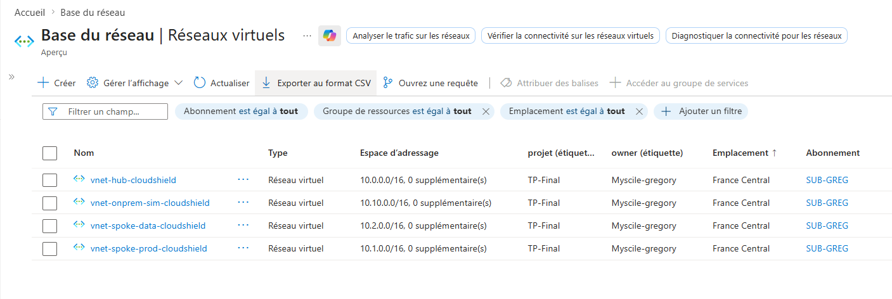
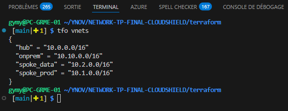

# <i class="fa-solid fa-clipboard-check"></i> LIVRABLE 4 — Cahier de Recette & 10 Preuves Techniques ANSSI

<div style="margin-bottom:1.5em">
  
  
  
</div>

## Objectif

Prouver techniquement l'implémentation de **10 règles spécifiques du Guide d'hygiène ANSSI** par des captures d'écran du portail Azure ou des tests de connectivité exécutés depuis les VMs.

---

## Preuve 1 — Règle ANSSI R19 : Segmentation réseau

| Élément                 | Détail                                                                                                                                                                                           |
| ----------------------- | ------------------------------------------------------------------------------------------------------------------------------------------------------------------------------------------------ |
| **Règle ANSSI**         | R19 — Segmenter le réseau et mettre en place un cloisonnement entre les zones réseau                                                                                                             |
| **Configuration Azure** | 4 VNets séparés : Hub (10.0.0.0/16), Spoke-Prod (10.1.0.0/16), Spoke-Data (10.2.0.0/16), OnPrem-Sim (10.10.0.0/16). Peerings Hub↔Spokes avec Gateway Transit. Aucun peering direct entre Spokes. |
| **Méthode de preuve**   | **Capture portail** : Azure Portal → Resource Group → Virtual Networks → afficher les 4 VNets avec leurs address space distincts                                                                 |
| **Commande Terraform**  | `terraform output vnets`                                                                                                                                                                         |
| **Résultat attendu**    | 4 VNets isolés, communication inter-spokes uniquement via Hub Firewall                                                                                                                           |


```

---

## Preuve 2 — Règle ANSSI R22 : Interdiction d'accès Internet direct

| Élément                 | Détail                                                                                                                                                      |
| ----------------------- | ----------------------------------------------------------------------------------------------------------------------------------------------------------- |
| **Règle ANSSI**         | R22 — Interdire la connexion directe à Internet des postes ou serveurs sensibles                                                                            |
| **Configuration Azure** | UDR (Route Table) `rt-spoke-prod-to-fw` avec route 0.0.0.0/0 → Azure Firewall. Associée à snet-prod-web et snet-prod-app. BGP route propagation désactivée. |
| **Méthode de preuve**   | **Test de connectivité** depuis vm-web (via Bastion) + **Capture portail** : Effective Routes sur la NIC de vm-web                                          |

| **Résultat attendu** | `curl google.com` échoue (timeout). Effective Routes montre 0.0.0.0/0 → VirtualAppliance (IP Firewall) |

### Tests à exécuter

```bash
# 1. Connexion via Bastion à vm-web
VM_WEB_ID=$(az vm show -g rg-cloudshield-prod -n vm-web-cloudshield --query id -o tsv)
az network bastion ssh --name bastion-cloudshield \
  --resource-group rg-cloudshield-prod \
  --target-resource-id $VM_WEB_ID \
  --auth-type ssh-key --username azureuser --ssh-key ~/.ssh/id_ed25519

# 2. Test accès Internet direct (DOIT ÉCHOUER)
curl -s --connect-timeout 5 http://google.com
# Résultat attendu : timeout / connection refused

# 3. Capture portail :
# NIC vm-web → Effective Routes → 0.0.0.0/0 → VirtualAppliance → 10.0.1.4
```

---

## Preuve 3 — Règle ANSSI R14 : Authentification forte

| Élément | Détail |
| ------- | ------ |

| **Règle ANSSI** | R14 — Mettre en place des mécanismes d'authentification forte |
| **Configuration Azure** | VMs déployées avec clés SSH Ed25519 uniquement (pas de mot de passe). Aucune IP publique sur les VMs. Accès uniquement via Azure Bastion. |

| **Méthode de preuve** | **Capture portail** : Vue NIC de vm-db → montrer "Public IP address: None". Vue VM → montrer "Password authentication: Disabled" |
| **Résultat attendu** | Zéro IP publique, authentification par clé SSH uniquement |

### Test à exécuter

```bash
# Portail Azure :
# VM vm-db → Networking → NIC → vérifier "Public IP address: None"
# VM vm-db → Overview → vérifier "Authentication type: SSH public key"

# Tentative SSH direct (DOIT ÉCHOUER — pas d'IP publique)
ssh azureuser@<vm-db-private-ip>
# Résultat : timeout (pas d'IP publique, pas de route)
```

---

## Preuve 4 — Règle ANSSI R25 : Chiffrement des interconnexions

| Élément | Détail |
| ------- | ------ |

| **Règle ANSSI** | R25 — Sécuriser les interconnexions réseau dédiées avec des tiers |
| **Configuration Azure** | VPN IPsec IKEv2 entre Hub (BGP AS 65001) et OnPrem (BGP AS 65002). Pre-Shared Key 35+ caractères. Connexion Vnet2Vnet avec BGP activé. |
| **Méthode de preuve** | **Capture portail** : VPN Gateway → Connections → Status = "Connected". BGP peer status showing established sessions. |

| **Résultat attendu** | Tunnel IPsec IKEv2 établi, routes BGP échangées |

### Test à exécuter

```bash
# Portail Azure :
# VPN Gateway vpngw-hub-cloudshield → Connections → cn-vpn-hub-to-onprem → Status: Connected

# Azure CLI :
az network vpn-connection show \
  --name cn-vpn-hub-to-onprem \
  --resource-group rg-cloudshield-prod \
  --query "{status:connectionStatus, protocol:connectionProtocol, bgp:enableBgp}"
# Résultat attendu : { "status": "Connected", "protocol": "IKEv2", "bgp": true }

# Vérifier les routes BGP apprises :
az network vnet-gateway list-learned-routes \
  --name vpngw-hub-cloudshield \
  --resource-group rg-cloudshield-prod
# Résultat : route 10.10.0.0/16 apprise via BGP
```

---

## Preuve 5 — Règle ANSSI R36 : Journalisation centralisée

| Élément                 | Détail                                                                                                                      |
| ----------------------- | --------------------------------------------------------------------------------------------------------------------------- |
| **Règle ANSSI**         | R36 — Activer et configurer les journaux des composants les plus importants                                                 |
| **Configuration Azure** | Log Analytics Workspace `law-cloudshield` avec AMA sur 3 VMs, NSG Flow Logs v2, Diagnostic Settings sur Firewall et Bastion |

| **Méthode de preuve** | **Capture portail** : Log Analytics → Logs → requête KQL montrant des données Syslog + Flow Logs |
| **Résultat attendu** | Données Syslog, Perf et NetworkSecurityGroupFlowEvent présentes dans le workspace |

### Tests à exécuter

```kql
// Requête 1 : Vérifier que Syslog est collecté depuis les VMs
Syslog
| where TimeGenerated > ago(1h)
| summarize count() by Computer, Facility
| order by count_ desc

// Requête 2 : Vérifier les Flow Logs NSG
AzureNetworkAnalytics_CL
| where TimeGenerated > ago(1h)
| summarize count() by FlowType_s, FlowStatus_s
| order by count_ desc

// Requête 3 : Logs Firewall
AzureDiagnostics
| where Category == "AzureFirewallNetworkRule" or Category == "AzureFirewallApplicationRule"
| where TimeGenerated > ago(1h)
| project TimeGenerated, msg_s, Category

| take 20
```

---

## Preuve 6 — Règle ANSSI R19 (Zero Trust) : Micro-segmentation — Isolation Web↔DB

| Élément         | Détail                                                         |
| --------------- | -------------------------------------------------------------- |
| **Règle ANSSI** | R19 — Segmentation + Zero Trust : mouvement latéral impossible |

| **Configuration Azure** | NSG nsg-data-db : autoriser uniquement asg-app → asg-db (TCP/5432). Deny-all inbound (prio 4000). vm-web n'est PAS dans asg-app → ne peut pas atteindre vm-db. |
| **Méthode de preuve** | **Test de connectivité** depuis vm-web vers vm-db (doit échouer) |
| **Résultat attendu** | ping vm-db → timeout. SSH vm-db → connection refused. Mouvement latéral impossible. |

### Tests à exécuter (démonstration soutenance)

```bash
# Connexion via Bastion à vm-web
VM_WEB_ID=$(az vm show -g rg-cloudshield-prod -n vm-web-cloudshield --query id -o tsv)
az network bastion ssh --name bastion-cloudshield \
  --resource-group rg-cloudshield-prod \
  --target-resource-id $VM_WEB_ID \
  --auth-type ssh-key --username azureuser --ssh-key ~/.ssh/id_ed25519

# Test 1 : Ping vm-db (DOIT ÉCHOUER)
ping -c 3 10.2.1.4
# Résultat : 100% packet loss

# Test 2 : SSH vm-db (DOIT ÉCHOUER)
ssh -o ConnectTimeout=5 azureuser@10.2.1.4
# Résultat : Connection timed out

# Test 3 : PostgreSQL depuis vm-web (DOIT ÉCHOUER)
nc -zv 10.2.1.4 5432
# Résultat : Connection timed out

# ──────────────────────────────────────────────────────────────

# En comparaison : depuis vm-app (qui EST dans asg-app)
# Connexion via Bastion à vm-app, puis :
nc -zv 10.2.1.4 5432
# Résultat : Connection OK (port open)
```

---

## Preuve 7 — Règle ANSSI R23 : Filtrage sortant via Firewall

| Élément | Détail |
| ------- | ------ |

| **Règle ANSSI** | R23 — Utiliser un proxy et des passerelles de sécurité pour l'accès Internet |
| **Configuration Azure** | Azure Firewall avec règles FQDN : seuls Ubuntu updates, Azure Monitor et PyPI autorisés. Tout autre trafic sortant bloqué (deny implicite). |
| **Méthode de preuve** | **Test de connectivité** depuis vm-app : `apt update` fonctionne, `curl google.com` échoue |
| **Résultat attendu** | Mises à jour OS OK, navigation libre bloquée |

### Tests à exécuter

```bash
# Connexion via Bastion à vm-app

# Test 1 : apt update (DOIT RÉUSSIR — FQDN autorisé)
sudo apt update
# Résultat : packages mis à jour (via archive.ubuntu.com autorisé dans FW)

# Test 2 : curl google.com (DOIT ÉCHOUER — FQDN non autorisé)
curl -s --connect-timeout 5 http://google.com
# Résultat : timeout


# Test 3 : curl site malveillant (DOIT ÉCHOUER)
curl -s --connect-timeout 5 http://malware-test.example.com
# Résultat : timeout (Threat Intelligence + deny)

# Vérifier dans les logs Firewall :
# AzureDiagnostics | where Category == "AzureFirewallApplicationRule" | where msg_s contains "Deny"

```

---

## Preuve 8 — Règle ANSSI R28 : Administration sécurisée (Bastion)

| Élément | Détail |

| ----------------------- | ---------------------------------------------------------------------------------------------------------------------------------- |
| **Règle ANSSI** | R28 — Protéger les flux d'administration |
| **Configuration Azure** | Azure Bastion dans le Hub. SSH/RDP uniquement via tunnel Bastion (portail ou CLI). Aucun port 22 ouvert sur les NSG vers Internet. |
| **Méthode de preuve** | **Capture portail** : Session Bastion active + NSG nsg-prod-web montrant aucune règle SSH depuis Internet |
| **Résultat attendu** | Session Bastion SSH fonctionnelle, port 22 non exposé |

### Test à exécuter

```bash
# Connexion Bastion CLI (preuve que SSH fonctionne via Bastion)
VM_WEB_ID=$(az vm show -g rg-cloudshield-prod -n vm-web-cloudshield --query id -o tsv)
az network bastion ssh --name bastion-cloudshield \
  --resource-group rg-cloudshield-prod \
  --target-resource-id $VM_WEB_ID \
  --auth-type ssh-key --username azureuser --ssh-key ~/.ssh/id_ed25519

# Résultat : connexion SSH réussie (sans IP publique, sans port 22 exposé)
whoami
# azureuser

# Capture portail :

# NSG nsg-prod-web → Inbound rules → aucune règle Allow SSH depuis Internet
# Bastion → Activity Logs → session SSH auditable
```

---

## Preuve 9 — Règle ANSSI R15 : Sanctuarisation PaaS (Private Endpoints)

| Élément                 | Détail                                                                                                                                             |
| ----------------------- | -------------------------------------------------------------------------------------------------------------------------------------------------- |
| **Règle ANSSI**         | R15 — Protéger les accès aux ressources et services numériques sensibles                                                                           |
| **Configuration Azure** | Storage Account et Azure SQL avec `public_network_access_enabled = false`. Private Endpoints dans snet-data-pe. Private DNS Zones liées aux VNets. |
| **Méthode de preuve**   | **Test DNS** depuis vm-db : `nslookup` sur le Storage Account résout en IP privée (10.2.2.x), pas en IP publique                                   |
| **Résultat attendu**    | Résolution DNS → IP privée du Private Endpoint                                                                                                     |

### Tests à exécuter

```bash

# Connexion via Bastion à vm-db

# Test 1 : Résolution DNS Storage Account (DOIT résoudre en IP privée)
nslookup stcloudshield4b580ad2.blob.core.windows.net
# Résultat : Address: 10.2.2.4 (IP du Private Endpoint, PAS l'IP publique Azure)

# Test 2 : Résolution DNS Azure SQL (DOIT résoudre en IP privée)
nslookup sql-cloudshield-4b580ad2.database.windows.net
# Résultat : Address: 10.2.2.5 (IP du Private Endpoint)


# Test 3 : Depuis Internet (portail Azure) :
# Storage Account → Networking → "Public network access: Disabled"
# SQL Server → Networking → "Public network access: Disabled"
```

---

## Preuve 10 — Règle ANSSI R37 : Politique de journalisation et alerting

| Élément                 | Détail                                                                                                                                                                                                                                |
| ----------------------- | ------------------------------------------------------------------------------------------------------------------------------------------------------------------------------------------------------------------------------------- |
| **Règle ANSSI**         | R37 — Définir et appliquer une politique de journalisation                                                                                                                                                                            |
| **Configuration Azure** | Data Collection Rule (DCR) collectant Syslog (auth, daemon, kern) + compteurs de performance (CPU, mémoire, disque, réseau). Action Group AG-SecOps avec email. Alert Rules sur modifications NSG, Firewall Policy et Service Health. |
| **Méthode de preuve**   | **Capture portail** : Monitor → Alerts → Rules → montrer les 4 règles d'alerte actives. DCR → montrer les sources de données configurées.                                                                                             |
| **Résultat attendu**    | Alerte automatique déclenchée lors de toute modification de règle NSG                                                                                                                                                                 |

### Tests à exécuter

```bash
# Capture portail :
# 1. Monitor → Data Collection Rules → dcr-linux-cloudshield
#    → Data Sources : Syslog (auth, daemon, kern) + Performance counters
#    → Destinations : law-cloudshield

# 2. Monitor → Alerts → Alert Rules :
#    - ala-nsg-rule-change (modification NSG)

#    - ala-network-resource-delete (suppression ressource réseau)
#    - ala-fw-policy-change (modification Firewall)
#    - ala-azure-service-health (incidents Azure)

# 3. Test déclencher une alerte :
# Modifier manuellement une règle NSG → l'alerte ala-nsg-rule-change se déclenche
# → vérifier réception email à secops@fintechglobal.local
```

### Requête KQL — Vérification exhaustive des sources de logs

```kql
// Toutes les tables alimentées dans le workspace
search *
| where TimeGenerated > ago(24h)
| summarize count() by $table
| order by count_ desc

// Résultat attendu :
// Syslog          → logs système VMs
// Perf            → métriques CPU/mémoire/disque
// AzureDiagnostics → logs Firewall + Bastion
// AzureNetworkAnalytics_CL → Flow Logs NSG
```

---

## Synthèse des 10 Preuves

| #   | Règle ANSSI | Titre                         | Type de preuve                        | Criticité |
| --- | ----------- | ----------------------------- | ------------------------------------- | --------- |
| 1   | R19         | Segmentation réseau           | Capture portail (4 VNets)             | 🔴        |
| 2   | R22         | Pas d'accès Internet direct   | Test `curl` + Effective Routes        | 🔴        |
| 3   | R14         | Authentification forte        | Capture VM (no public IP, SSH key)    | 🔴        |
| 4   | R25         | Chiffrement IPsec IKEv2 + BGP | Capture VPN Connection Status         | 🔴        |
| 5   | R36         | Journalisation centralisée    | Requête KQL (Syslog, Flow Logs)       | 🔴        |
| 6   | R19 (ZT)    | Micro-segmentation Web→DB     | Test ping/SSH (isolation prouvée)     | 🔴        |
| 7   | R23         | Filtrage sortant Firewall     | Test `curl google.com` échoue         | 🔴        |
| 8   | R28         | Admin via Bastion             | Session Bastion + NSG sans SSH public | 🟠        |
| 9   | R15         | PaaS Private Endpoints        | Test `nslookup` → IP privée           | 🟠        |
| 10  | R37         | Politique de journalisation   | Capture Alert Rules + DCR             | 🟠        |

---

## Démonstration Soutenance — Scénario d'Étanchéité

**Scénario** : Un attaquant a compromis vm-web. Démontrer que :

1. **Impossible de pinguer vm-db** : `ping 10.2.1.4` → 100% packet loss
2. **Impossible de SSH vers vm-db** : `ssh 10.2.1.4` → Connection timed out
3. **Impossible de sortir sur Internet** : `curl google.com` → timeout
4. **Seul flux autorisé** : vm-web → vm-app (TCP 8080) → vm-db (TCP 5432) — chaîne contrôlée

Ce scénario prouve en 2 minutes que l'architecture Cloud Shield respecte le modèle Zero Trust : **deny-all par défaut, allow explicitly**.
